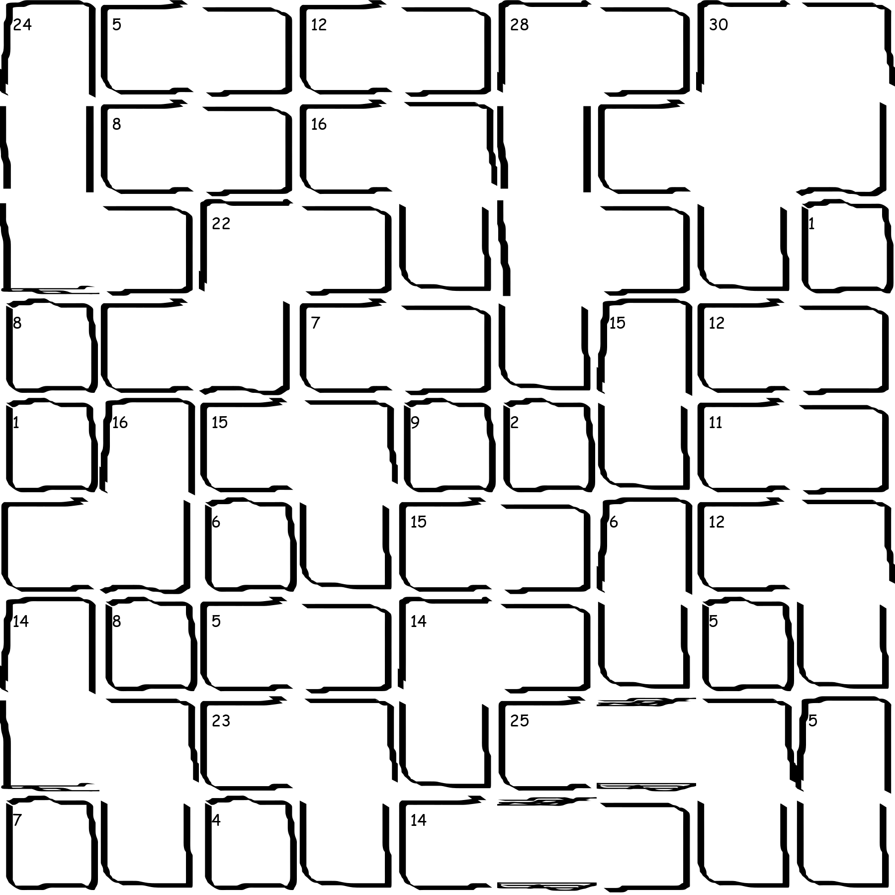

# sksg

SKSG stands for Shitty Killer Sudoku Generator. Killer sudoku is a sudoku variant where instead of getting starting numbers, the board is partitioned into disjoint cages, and you're given the sum of each cage. 

Here's what a board looks like:

The reason why it's a "shitty" sudoku generator is because I drew all of the cage assets using my mouse. I ripped the algorithm off of these two sources:

1. https://github.com/norvig/pytudes/blob/main/ipynb/Sudoku.ipynb (Peter Norvig sudoku generator)
2. https://stackoverflow.com/questions/3397972/divide-grid-2d-array-into-random-shaped-parts (Grid partitioning algorithm)
